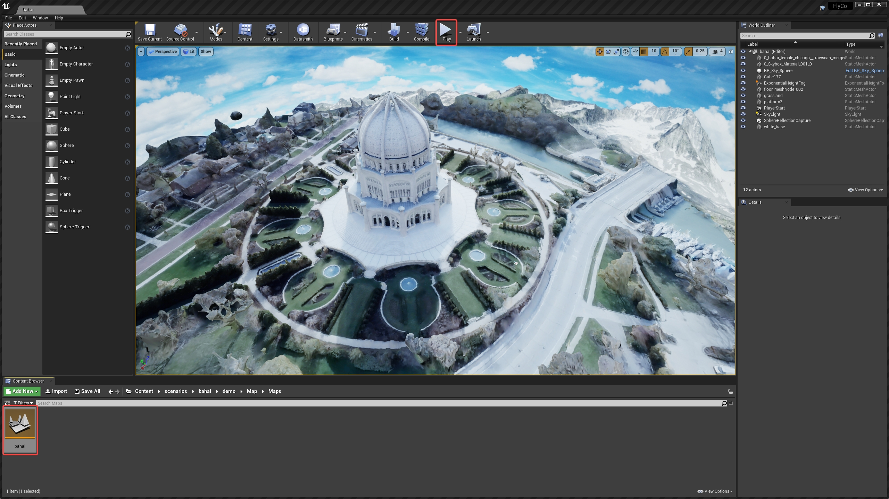
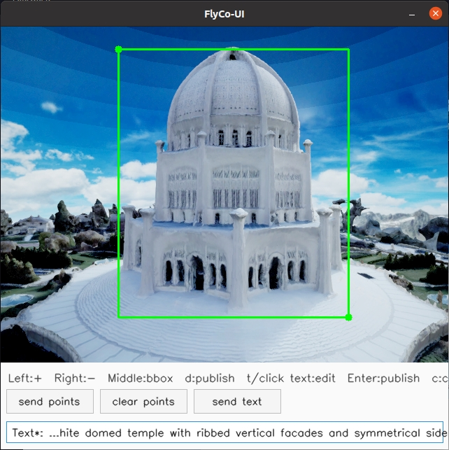

<div align="center">
    <!-- <h1>FlyCo</h1> -->
    <h2>FlyCo: Foundation Model-Empowered Drones for Autonomous 3D Structure Scanning in Open-World Environments</h2>
    <br>
        <a href="https://chen-albert-feng.github.io/AlbertFeng.github.io/" target="_blank">Chen Feng</a><sup>1,*</sup>,
        <a href="https://gy920.github.io/" target="_blank">Guiyong Zheng</a><sup>2,*</sup>,
        <a>Tengkai Zhuang</a><sup>3</sup>,
        <a>Yongqian Wu</a><sup>3</sup>,
        <a>Fangzhan He</a><sup>3</sup>,
        <a>Haojia Li</a><sup>1</sup>,
        <a>Juepeng Zheng</a><sup>2</sup>,
        <a href="https://uav.hkust.edu.hk/group/" target="_blank">Shaojie Shen</a><sup>1</sup>,
        <a href="https://robotics-star.com/people" target="_blank">Boyu Zhou</a><sup>3</sup>
    <p>
        <h45> 
            <sup>1</sup>HKUST Aerial Robotics Group &nbsp;&nbsp;
            <sup>2</sup>SYSU &nbsp;&nbsp;
            <sup>3</sup>SUSTech STAR Lab &nbsp;&nbsp;
            <br>
        </h5>
        <sup>*</sup>Equal Contribution
    </p>
    <a href='https://arxiv.org/pdf/2601.07558'></a>
    <!-- <a href='https://hkust-aerial-robotics.github.io/FC-Planner/'></a> -->
    <a href="https://www.youtube.com/playlist?list=PLqjZjnqsCyl40rw3y15Yzc7Mdo-z1y2j8"></a>
</div>

## 📢 News

* **[09/06/2026]**: The released **F**ly**C**o codebase and development environment setup are now available.

## 📜 Introduction

This repository maintains the implementation of "**F**ly**C**o: Foundation Model-Empowered Drones for Autonomous 3D Structure Scanning in Open-World Environments", owned by [Chen Feng](https://chen-albert-feng.github.io/AlbertFeng.github.io/) and [Guiyong Zheng](https://gy920.github.io/).

<p align="center">
  &nbsp;&nbsp;&nbsp;&nbsp;
  
</p>

**F**ly**C**o is a novel and principled system architecture that synergizes foundation models scene knowledge with drone flight skills for open-world aerial 3D structure scanning. Driven solely by simple human prompts, it achieves fully autonomous, safe, and efficient scanning without the laborious manual intervention required by existing methods, filling critical gaps in open-world practicality.

<p align="center">
  &nbsp;&nbsp;&nbsp;&nbsp;
  
</p>

<p align="center">
  &nbsp;&nbsp;&nbsp;&nbsp;
  
</p>

Please cite our paper if you use this project in your research:

```
@article{feng2026flyco,
  title={FlyCo: Foundation Model-Empowered Drones for Autonomous 3D Structure Scanning in Open-World Environments},
  author={Feng, Chen and Zheng, Guiyong and Zhuang, Tengkai and Wu, Yongqian and He, Fangzhan and Li, Haojia and Zheng, Juepeng and Shen, Shaojie and Zhou, Boyu},
  journal={arXiv preprint arXiv:2601.07558},
  year={2026}
}
```

**License Notice**: This project is released under the PolyForm Noncommercial License 1.0.0 and is intended for non-commercial use only; commercial use is not permitted without explicit permission from the copyright owners. Please see [LICENSE](LICENSE) for details.

Please kindly star ⭐️ this project if it helps you. We take great efforts to develop and maintain it 😁.

## 🛠️ Installation

**Note:** Please make sure you have at least 150 GB of free disk space before installation.

First, clone this repository:

```bash
git clone git@github.com:FC-Family/FlyCo.git
cd FlyCo
```

Then, please refer to the following module-specific instructions for step-by-step setup details:

- [perception_predictor](./perception_predictor/README.md)
- [planner_simulator](./planner_simulator/README.md)

Finally, download the UE simulation environments from [Google Drive](https://drive.google.com/drive/folders/1BXd7_2unaK4iHz50_pSFBnJU25b3mYVl?usp=sharing).

## 🚀 Quick Start

* Open a demo scenario

Launch UE and open the scenario you want to test from `Content/scenarios/${DEMO_SCENARIO}/Maps`:
<p align="center">
  
</p>

Available Demo Scenarios:

<table align="center">
  <tr>
    <td align="center"><code>arc</code></td>
    <td align="center"><code>bahai</code></td>
    <td align="center"><code>buddha</code></td>
    <td align="center"><code>castle</code></td>
  </tr>
  <tr>
    <td align="center"><code>christ</code></td>
    <td align="center"><code>church</code></td>
    <td align="center"><code>outpost</code></td>
    <td align="center"><code>pagoda</code></td>
  </tr>
  <tr>
    <td align="center"><code>pisa_cathedral</code></td>
    <td align="center"><code>sacre_coeur</code></td>
    <td align="center"><code>sant</code></td>
    <td align="center"><code>schloss</code></td>
  </tr>
  <tr>
    <td align="center"><code>statue</code></td>
    <td align="center"><code>temple</code></td>
    <td align="center"><code>tower</code></td>
    <td align="center"><code>windmill</code></td>
  </tr>
</table>

* Start the full **F**ly**C**o stack

```shell
cd scripts && ./run.sh -s ${DEMO_SCENARIO}
```

For example:

```shell
./run.sh -s bahai
```

A joystick is recommended for triggering the system:
<p align="center">
  
</p>

1. Press the ***"LB"*** button to initialize all modules.
2. Press the ***"Y"*** button to start initial flight.
3. In the ***`FlyCo-UI`*** window, specify the target structure by using the ***middle mouse button*** to either drag a bounding box around it, or by clicking points on it with the ***left mouse button***. Then, click `send points` or press `d` to publish the prompt. Afterwards, you can enter a textual prompt in the text box and similarly click `send text` to publish it.

<p align="center">
  
</p>

4. Press the ***"X"*** button to enable all services.
5. Press the ***"RB"*** to start autonomous scanning flight.

* Stop all **F**ly**C**o services after the task is completed

```shell
cd scripts & ./kill.sh
```

## 🤗 FC-Family Works

#### 1. What is [FC-Family](https://github.com/FC-Family)?

We aim to develop intelligent active perception flight to realize ***F***ast and reliable ***C***overage / s***C***anning / re***C***onstruction / inspe***C***tion etc.

#### 2. Projects list

* [PredRecon](https://github.com/HKUST-Aerial-Robotics/PredRecon) (ICRA2023): Prediction-boosted Planner for Aerial Reconstruction.
* [FC-Planner](https://github.com/HKUST-Aerial-Robotics/FC-Planner) (ICRA2024): Highly Efficient Global Planner for Aerial Coverage.
* [SOAR](https://github.com/SYSU-STAR/SOAR) (IROS2024): Heterogenous Multi-UAV Planner for Aerial Reconstruction.
* [FC-Vision](https://github.com/FC-Family/FC-Vision) (RA-L2026): Online Visibility-aware Replanning for Occlusion-free Aerial Scanning.
* [FlyCo](https://github.com/FC-Family/FlyCo): Complete and Prompt-Driven System for Open-World Aerial 3D Structure Scanning.
