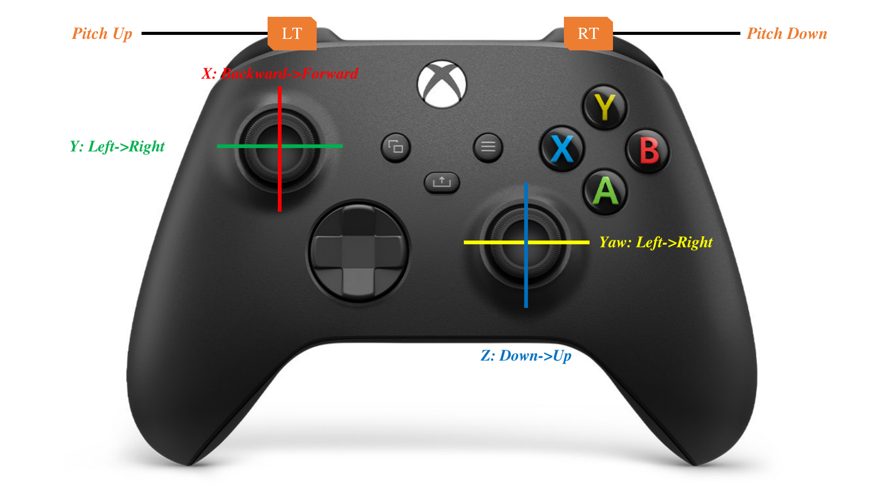

# Realistic AirSim Simulator

## Installation

* [**Pre-requisites**] Make sure 50GB space in your disk.

1. Install Unreal Engine

```
  git clone -b 4.25 git@github.com:EpicGames/UnrealEngine.git
  cd UnrealEngine
  ./Setup.sh
  ./GenerateProjectFiles.sh
  make
```

2. Install AirSim

```
  git clone https://github.com/Microsoft/AirSim.git
  cd AirSim
  ./setup.sh
  ./build.sh
```

Modify your ```~/Documents/AirSim/settings.json``` as the same as [setting.json](./script/setting/settings.json).

## Usage

1. AirSim Node
```shell
cd ${YOUR_WORKSPACE_PATH}
source devel/setup.zsh
roslaunch airsim_ros_pkgs airsim_node.launch
```

2. Manual Joystick Controller
<p align="center">
  
</p>

* You should firstly launch this shell and then trigger the LT and RT keys at the same time to unlock the device. Afterwards, you can run the shells above.
* Press ***"A"*** button to activate joy control and press ***"B"*** button to deactivate joy control.

```shell
cd ${YOUR_WORKSPACE_PATH}
source devel/setup.zsh
roslaunch ue4_control joy_control.launch
```